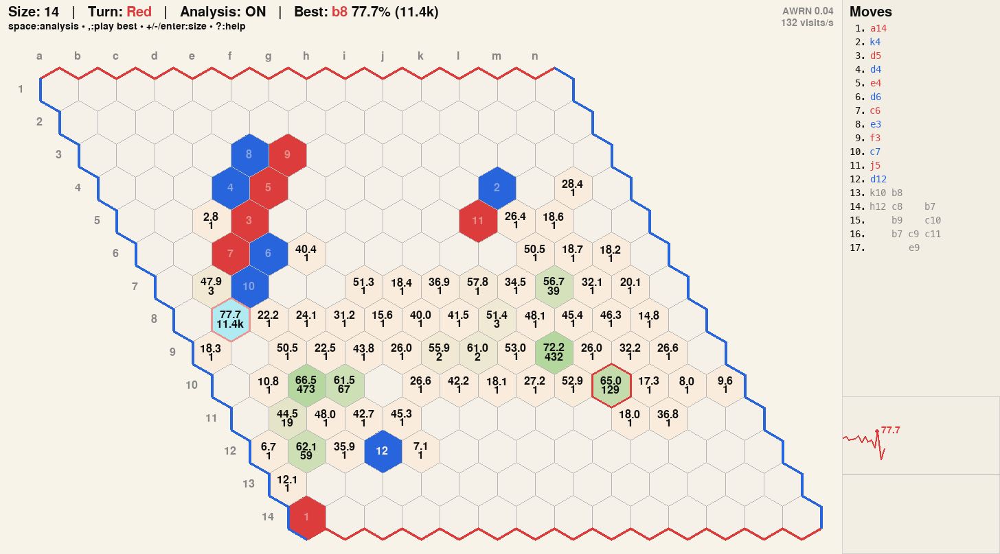

# Hexata GUI

A lightweight, keyboard-first GUI for analyzing Hex with the [KataHex](https://www.hexwiki.net/index.php/KataHex) engine. Built with substantial AI assistance.

## Main features
- Interactive board with optional move numbers and drag-to-move editing.
- Live engine analysis overlays (winrate/visits, priors, candidates, Elo view).
- Dedicated candidate search mode with automatic switching.
- Move list panel with undo/redo, navigation ([HexWorld](https://hexworld.org/board/#14c1)-style shortcuts), and eval graph (winrate or Elo).
- Clipboard import/export to HexWorld.
- Adjustable board size and analysis noise.
- Fast, responsive feel with low engine and UI latency.

## Quick setup
- Install deps: `pip install -r requirements.txt` (pygame only).
- Install KataHex separately (engine binary, config, and model weights): [KataHex 20240812](https://github.com/hzyhhzy/KataGomo_fork/releases/tag/Hex_20240812)
- Edit `ENGINE_CMD_STR` in `engine.py` to point at your KataHex binary, config, and model.
- Example format: `ENGINE_CMD_STR = "path/to/katahex gtp -config path/to/engine.cfg -model path/to/weights.bin.gz"`
- Run: `python3 main.py`

## Quick controls
- `?` help
- `space` toggle analysis
- `p/n` prev/next, `f/l` first/last
- `m` move numbers, `c` coords, `t` priors, `e` Elo view
- Right-click or drag to toggle candidates

## Files at a glance
- `main.py`: App entry point; creates the board, engine, and GUI.
- `gui.py`: Pygame UI, rendering, layout, and input handling.
- `gui_core.py`: Game state, move history, analysis caching, engine coordination.
- `engine.py`: Engine process wrapper, GTP-ish parsing, and analysis I/O.
- `board.py`: Hex board model, history, and move rules.
- `hexworld.py`: HexWorld import/export parsing utilities.

## Notes on tricky parts
A few implementation details were tricky to get right and are useful background for understanding the design:
- Three coordinate systems are in play: GUI board coordinates, engine play coordinates, and KataHex analyze tokens.
- KataHex uses a nonstandard GTP-ish dialect. The GUI uses a minimal handshake (mute until the first "=" after `kata-analyze`) to keep latency low while avoiding analysis leakage.
- Candidate search isn’t a native KataHex mode. The GUI simulates it by cycling candidates as temporary roots and collecting per-candidate results, but because each position is evaluated from scratch (with only partial internal caching), the switching policy needs to reduce wasted rebuild time and make steady progress per candidate.
- Candidate search runs with analysisWideRootNoise set to 0, matching non-root analysis behavior for cleaner comparisons.

## Limitations
- No native swap rule handling (except when loading a HexWorld position).
- No principal variations display.
- No branching move history, buttons, or clickable move list.
- Only tested on macOS; other platforms or some HiDPI setups may need tweaks.
- No robust engine error handling or recovery yet, though it hasn’t been an issue in testing.
